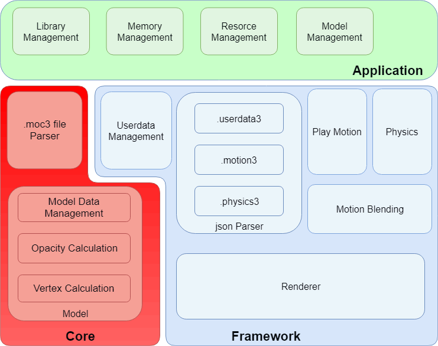

### 查考文档
- https://docs.live2d.com/en/cubism-sdk-manual/cubism-core-api-reference/
- [NativeCoreAPIReference5.pdf](cubism_sdk/NativeCoreAPIReference5.pdf)
### SDK 下载
https://www.live2d.com/en/sdk/download/native/ 
dll：动态链接 
include：函数头 
lib：静态链接
### 资源下载
- https://www.live2d.com/en/learn/sample/
- https://github.com/Eikanya/Live2d-model
- https://github.com/oh-my-live2d/live2d-models
### 核心流程
#### 主要关系

#### 模型文件加载

#### 模型刷新

#### 可绘制对象更新

#### DynamicFlag 更新
